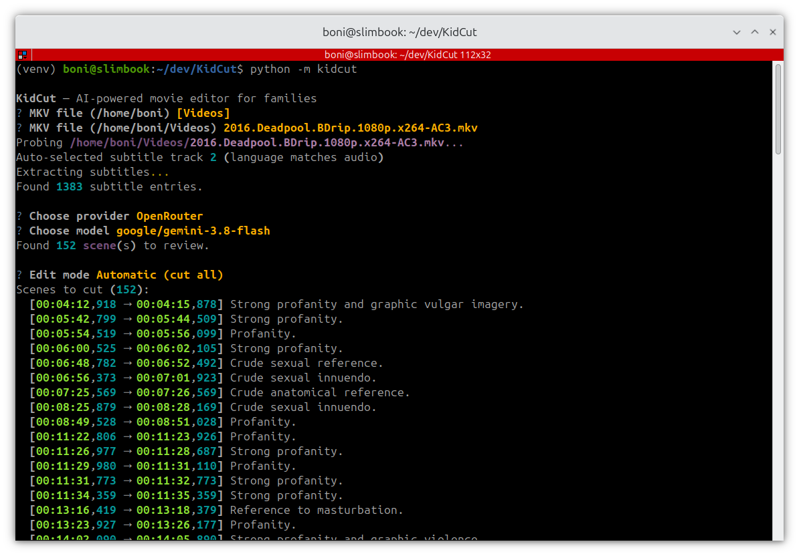
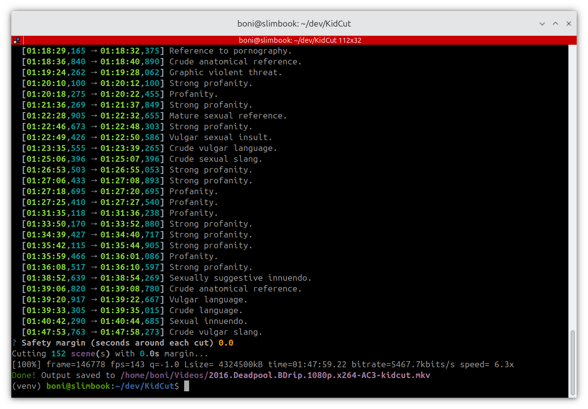

# KidCut 

An AI-powered CLI tool that detects and removes adult content from MKV movies to create kid-friendly versions. It uses AI models to analyze the movie subtitles and [ffmpeg](https://ffmpeg.org/) to cut the flagged fragments.

## Quickstart

KidCut is a Python CLI tool. Run it from the repository root with:

```bash
python -m kidcut
```

Before the first run, install its dependencies (e.g., with `pip install -e .`).

### Requirements

- **Python 3.11+**
- **ffmpeg** and **ffprobe** installed and available in your `PATH`
- An MKV file with a **text-based subtitle track** (SRT, ASS, or SSA). Image-based subtitles (e.g., PGS or VobSub) are not supported.

### AI providers

KidCut offers the providers for which an API key (or local service) is available:

| Provider   | Configuration                         |
|------------|---------------------------------------|
| OpenAI     | `OPENAI_API_KEY`                      |
| Anthropic  | `ANTHROPIC_API_KEY`                   |
| Google     | `GOOGLE_API_KEY`                      |
| OpenRouter | `OPENROUTER_API_KEY`                  |
| Ollama     | Local service at `http://localhost:11434` |

### Interactive workflow

1. **Select MKV**: browse the filesystem (starting at your home folder) to pick the movie file.
2. **Track detection**: KidCut auto-selects the subtitle track matching the language of the default audio track (or lets you pick the tracks manually if there is no match).
3. **Subtitle extraction**: the subtitles are extracted with ffmpeg and parsed (SRT/ASS).
4. **Choose AI provider and model**: from the providers available in your environment.
5. **AI analysis**: the model flags the individual subtitle entries unsuitable for children under 12 (e.g., profanity, sexual references, or graphic violence), each one with a brief reason.
6. **Edit mode**: choose *Automatic* (cut all flagged entries) or *Manual* (review each one and choose *Cut* or *Keep*).
7. **Safety margin**: optionally, add some seconds before and after each cut (default: `0.0`, since cuts are frame-accurate).
8. **Output**: ffmpeg re-encodes the movie without the flagged fragments, showing its progress, and saves it next to the input as `<name>-kidcut.mkv`.

## Example

The following screenshots show a complete execution of KidCut. The selected movie contains 1383 subtitle entries, and the model (`google/gemini-3.8-flash` through OpenRouter) flagged 152 of them. In automatic mode, KidCut lists all the entries to cut:



Then, after choosing the safety margin, ffmpeg cuts the 152 fragments and writes the kid-friendly version:



## Limitations

- KidCut only analyzes dialogue (i.e., subtitles). Therefore, scenes without dialogue (e.g., visual-only content) are not detected.
- The output is re-encoded (H.264 video and AAC audio), so processing takes time (proportional to the movie length) and the output quality may differ from the original.
- The whole subtitle track is sent to the model in a single request, so the chosen model needs a context window large enough for a full movie.

## Architecture

```
src/kidcut/
  cli.py             — orchestrator (full interactive workflow)
  vendors.py         — vendor discovery and model listing
  scanner.py         — AI analysis of subtitles
  subtitle.py        — SRT and ASS subtitle parser
  ffmpeg.py          — ffmpeg binary check, track probing, subtitle extraction, and scene cutting
  editor.py          — automatic and manual edit modes
  models.py          — data classes
  ui.py              — spinner helper
  templates/
    review_prompt.md — AI prompt (editable)
```

The prompt used to analyze the subtitles is a plain Markdown template (`src/kidcut/templates/review_prompt.md`), so you can adjust the criteria (e.g., the target age) without changing the code.

## About

KidCut (Copyright &copy; 2026) is an open-source project created and maintained by [Boni Garcia](https://bonigarcia.dev/), licensed under the terms of [Apache 2.0 License](https://www.apache.org/licenses/LICENSE-2.0).
